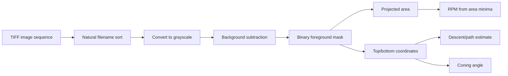

# Mahagony Seed Decent Analysis through Image Tracking

MATLAB code and captured outputs for image-based analysis of a rotating/falling **samara** (winged seed). The supplied material contains scripts for background subtraction, projected-area tracking, descent/path tracking, rotational-speed estimation, coning-angle estimation, image-axis annotation, and supporting utilities.

> **Important:** The supplied source material is preserved. The analysis documentation does not rewrite the original MATLAB logic.

## Analysis pipeline

The project also contains `code_extract.mlx`, which is a separate MATLAB Live Script for working with `.dat` velocity-field data, coordinate transformations, pointwise velocity extraction, and velocity profiles.

## Project files

The original project contains:

- `decent_test_02_08_22_new.m`: newer samara image-processing workflow
- `decent_test_02_08_22.m` : earlier descent/area/RPM/coning workflow
- `decent_test_02_08_22-2` : another earlier workflow variant
- `code_extract.mlx` : MATLAB Live Script for velocity-field data extraction
- `Add_axis_to_the_image.m` : adds a calibrated axis image to PNG frames
- `grabit.m` : image digitization/calibration utility
- `natsort.m`, `natsortfiles.m` : natural filename sorting utilities
- `natsortfiles_doc.m`, `natsortfiles_test.m` : documentation/tests for natural sorting
- `matlab.m` : additional MATLAB analysis code
- `scale.tif` : supplied scale/reference image
- `vid_2022-10-06_13-30-27_2.mp4` : supplied experimental video
- `19n1.png`, `19n1_.png` : supplied output figures

## What the main samara analysis does

The newer descent script reads TIFF frames, converts them to grayscale, uses the first frame as a background, and performs pixel-wise background subtraction with a threshold of `15`. It counts foreground pixels as projected area and records top/bottom and left/right image coordinates. It then plots the samara path, estimates vertical descent velocity, plots projected area versus image number, identifies low-area frames, estimates RPM, and estimates coning angles.

The older descent variants use a threshold of `10` and contain somewhat different path, RPM, and coning-angle calculations. These variants should therefore be treated as separate experimental versions rather than assumed to be numerically identical.

## Figures

### Projected Area Variation

The supplied plot shows projected area in pixels against image number. The curve has a large early maximum followed by repeated oscillations with a generally decreasing envelope. The analysis code uses local low-area frames as rotational landmarks for RPM estimation.

### Samara Path Tracking

The supplied path plot shows the tracked samara in image coordinates. It is predominantly descending through the camera field, with a long diagonal segment and a narrower, mostly vertical portion with smaller lateral variations.

## Calibration and reproducibility

The source embeds experimental calibration constants including `0.00082`, `0.000857`, and `1057`. Their exact provenance and units are not fully documented in the source and should be verified before using derived velocity or RPM values quantitatively.

The scripts also contain machine-specific Windows paths. These paths are preserved as supplied rather than silently changed.

Before publication-quality use, verify:

1. camera frame rate and the meaning of `1057`;
2. pixel-to-metre calibration;
3. background-frame validity;
4. sensitivity to the background threshold;
5. image-coordinate orientation;
6. how many rotational events correspond to each detected area minimum;
7. coning-angle geometry;
8. MATLAB release/toolbox compatibility.

## Report

See [`REPORT.md`](REPORT.md) for the detailed source-grounded technical analysis, limitations, and validation recommendations.
